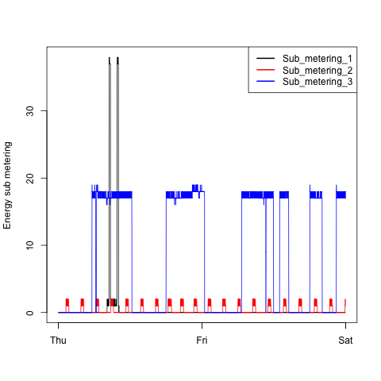

===
title: "Readme.MD for JH 'Exploratory Data Analysis Project 1'"
author: "Matthew Pemble"
output: html_document
===

# Readme.MD
============
## Course
This is the Readme file for the first course project
for the Johns Hopkins "Exploratory Data Analysis"
Coursera course.

Author: Matthew Pemble
Github: gothub.com/mwapemble
Course: exdata-033, 5 Oct 15

## Data
This assignment uses data from
the <a href="http://archive.ics.uci.edu/ml/">UC Irvine Machine
Learning Repository</a>, a popular repository for machine learning
datasets. 

The particular dataset used is the "Individual Household electric power consumption Data Set", which was downloaded, for the final data run, 
from the course website on Fri Oct  9 11:35:19 2015 (BST / A)

<b>Dataset</b>: <a href="https://d396qusza40orc.cloudfront.net/exdata%2Fdata%2Fhousehold_power_consumption.zip">Electric power consumption</a> [20Mb]

###<b>Description</b>: 
Measurements of electric power consumption in
one household with a one-minute sampling rate over a period of almost
4 years. Different electrical quantities and some sub-metering values
are available.

The following descriptions of the 9 variables in the dataset are taken
from
the <a href="https://archive.ics.uci.edu/ml/datasets/Individual+household+electric+power+consumption">UCI
web site</a>:

<ol>
<li><b>Date</b>: Date in format dd/mm/yyyy </li>
<li><b>Time</b>: time in format hh:mm:ss </li>
<li><b>Global_active_power</b>: household global minute-averaged active power (in kilowatt) </li>
<li><b>Global_reactive_power</b>: household global minute-averaged reactive power (in kilowatt) </li>
<li><b>Voltage</b>: minute-averaged voltage (in volt) </li>
<li><b>Global_intensity</b>: household global minute-averaged current intensity (in ampere) </li>
<li><b>Sub_metering_1</b>: energy sub-metering No. 1 (in watt-hour of active energy). It corresponds to the kitchen, containing mainly a dishwasher, an oven and a microwave (hot plates are not electric but gas powered). </li>
<li><b>Sub_metering_2</b>: energy sub-metering No. 2 (in watt-hour of active energy). It corresponds to the laundry room, containing a washing-machine, a tumble-drier, a refrigerator and a light. </li>
<li><b>Sub_metering_3</b>: energy sub-metering No. 3 (in watt-hour of active energy). It corresponds to an electric water-heater and an air-conditioner.</li>
</ol>

## Data Processing
_(note that the 3rd level headers are displaying inconsistently - Loading Data and Plots 1 & 4 are okay, Plots 2 & 3 are not. The ordered lists are correctly terminated and the syntax is identical. Preview in RStudio also shows okay. Ho hum._ Matthew)

### Loading Data
As the four R scripts were required to run independently, a common data loading and cleaning script was created, "common_data_source.R".

This script:
<ol>
<li>Initialises the variables for the specific data download.</li>
<li>Verifies whether a data directory exists and, if not, creates it.</li>
<li>Verifies whether the source data zipfile has been downloaded and, if not, downloads it. The download command is the version for running on Apple OSX.</li>
<li>Verifes whether the source data file exists and, if not, expands the zipfile.</li>
<li>Loads the source data in to a table, specifying the replacement of the unknown data marker '?' with the R-compliant 'NA'.</li>
<li>Converts the text time data into POSIXlt format. The date has to be added here otherwise it converts in to times on the run date. It is necessary to do this on the full data set before the conversion of the date data.</li>
<li>Converts the text date data into POSIXlt format.</li>
<li>Subsets the source data based on the variables 'startdate' and 'enddate'. To convert the script to a more generic function, these could be parameterised.</li>
<li>Converts the data columns required for the plots in to numeric format.</li>
</ol>

### Plot 1
This script 
<ol>
<li>initialises the single variable,</li>
<li>runs the common data source</li>
<li>sets the display to the required PNG format</li>
<li>and then generates a standard output histogram of the 'Global Active Power' data, formatted with the required main and x-axis labels and coloured red.</li></ol>

### Plot 2
This script 
<ol>
<li>initialises the single variable,</li>
<li>runs the common data source</li>
<li>sets the display to the required PNG format</li>
<li>and then generates a line plot of the 'Global Active Power' data against time, formatted with the required main and x-axis labels.</li></ol>

### Plot 3
This script 
<ol>
<li>initialises the single variable,</li>
<li>runs the common data source</li>
<li>sets the display to the required PNG format</li>
<li>generates a line plot of the 'Sub Metering 1' dataset against time, formatted with the required y and null x-axis labels.</li>
<li>adds a line for the 'Sub Metering 2' dataset against time</li>
<li>adds a line for the 'Sub Metering 3' dataset against time</li>
<li>adds the required legend using the names from the source data headers.</li>
</ol>

### Plot 4
This script reuses the plots from plot 2 & 3 but, in order not to re-run the common data source multiple times, incorporates them explicitly rather than calling the plot2.R and plot3.R functions.
Note that if the project specification did not require separate R scripts, the source and plot scripts could easily be re-worked and parameterised as functions and called from a base script.
The script:
<ol>
<li>initialises the single variable,</li>
<li>runs the common data source</li>
<li>sets the display to the required PNG format</li>
<li>formats the output in 2 x 2 format using mfcol</li>
<li>generates the Global Active Power against time plot</li>
<li>generates the Sub-Metering 1, 2 & 3 plot from plot3.R but modifying the legend to exclude the surrounding box,
<li>generates a new Voltage against time plot, with the x-axis label explicitly annotated because a separate datetime dataset was not created,</li>
<li>and then generates a line plot of the 'Global Reactive Power' data against time, explicitly generating the x-axis label as above.</li></ol>

## Results

### Plot 1
 

### Plot 2
 

### Plot 3
 

### Plot 4

## Acknowledgements
As well as the lectures and swirl tutorial, guidance on the use of specific functions was gained from:
<ul>
<li>"R in Action", 2nd Ed, R Kabacoff</li>
<li>"R for Excel Users", online version, J Taveras</li>
<li>RStudio.com, especially the "R Markdown Cheat Sheet"</li>
<li>and syntax examples from various stackoverflow.com threads (via the mechanism of Google).</li></ul>

